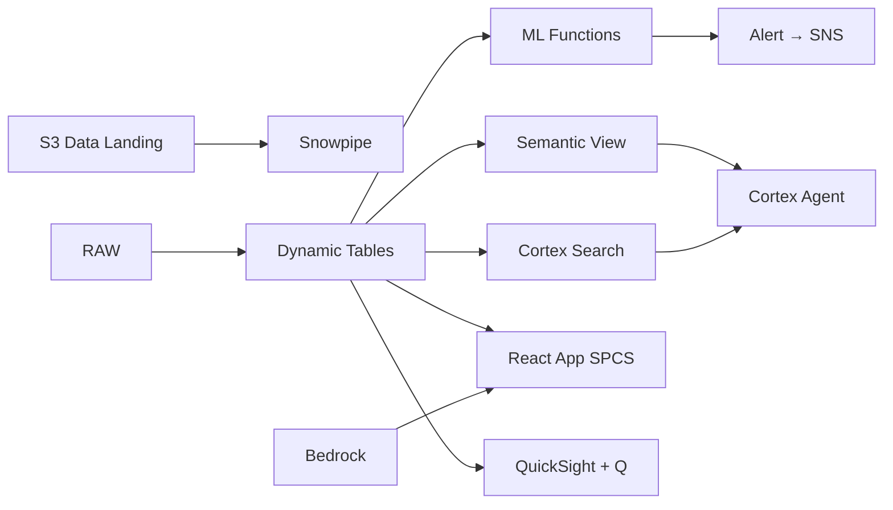

# Clinical Data Exchange

Secure clinical data exchange across 20 Thai hospitals — Iceberg + Lake Formation governs access, Row Access Policies enforce patient consent, and Cortex Complete generates clinical insights while preserving PDPA compliance.

## Architecture

Thailand's 20 leading hospitals hold 2 million patient records in siloed EHRs — preventing research, outcome benchmarking, and population health insights. PDPA (Thailand's privacy law) mandates consent-based sharing. Iceberg tables + Row Access Policies + Cortex Complete enable governed clinical intelligence without compromising patient privacy.



## Snowflake Capabilities

| Capability | Implementation |
|-----------|---------------|
| Dynamic Tables | PATIENT_COHORTS / TREATMENT_OUTCOMES / NETWORK_UTILIZATION / POPULATION_HEALTH |
| ML Functions | ML.FORECAST + ML.ANOMALY_DETECTION |
| Cortex AI | COMPLETE, AI_CLASSIFY, SUMMARIZE |
| Cortex Search | 200 documents indexed |
| Cortex Agent | CLINICAL_HIE_AGENT |
| Semantic View | CLINICAL_ANALYTICS |
| React App (SPCS) | 5 tabs + DemoGuide |


## AWS Services

| Service | Role in Demo |
|---------|-------------|
| AWS Lake Formation | Fine-grained access control on clinical data by hospital and purpose |
| Amazon S3 (Iceberg) | Store clinical data in open Iceberg format for interoperability |
| Amazon Bedrock (Claude) | Generate clinical research insights and population health narratives |
| Amazon Athena | Ad-hoc clinical research queries on Iceberg data |
| Amazon SNS | Alert data governance team on consent and compliance issues |
| Amazon QuickSight + Q | Clinical analytics dashboard with NL queries |


## Personas

| Persona | Role | Key Questions |
|---------|------|---------------|
| **Dr. Kamol Deerochanawong** | Chief Health Informatics Officer | "How many hospitals are actively sharing data?" "What's our PDPA consent coverage rate?" |
| **Dr. Supanee Tangjitgamol** | Clinical Research Director | "How many diabetic patients across the network are on GLP-1 therapy?" "Show me the treatment outcome comparison for knee replacement across hospitals." |


## Data

| Table | Rows | Description |
|-------|------|-------------|
| HOSPITALS | 20 | Network hospitals (BDMS, Bumrungrad, BNH, Siriraj referrals) |
| PATIENT_REGISTRY | 2,000,000 | De-identified patient records with consent flags (PDPA) |
| CLINICAL_ENCOUNTERS | 8,000,000 | Clinical encounters with diagnosis (ICD-10), procedures, and outcomes |
| LAB_RESULTS | 15,000,000 | Laboratory test results across the network |
| MEDICATIONS | 12,000,000 | Prescription and dispensing records |
| CONSENT_REGISTRY | 2,000,000 | Patient consent records for data sharing (PDPA compliance) |
| CLINICAL_GUIDELINES | 200 | Thai Medical Council clinical practice guidelines |
| THAI_HEALTH_SYSTEM | 10 | Thailand healthcare system overview |


## Build Instructions

### Prerequisites
- Snowflake account with ACCOUNTADMIN access
- Cortex AI enabled (ML Functions, Search, Agent)
- Warehouse: HIE_WH (Medium)
- AWS CLI with access (us-west-2)

### Deployment

```bash
snowsql -f snowflake/00_setup.sql
snowsql -f snowflake/01_marketplace_install.sql
snowsql -f snowflake/02_raw_tables.sql
snowsql -f snowflake/03_staging.sql
snowsql -f snowflake/04_dynamic_tables.sql
snowsql -f snowflake/05_search.sql
snowsql -f snowflake/06_ml_models.sql
snowsql -f snowflake/07_semantic_view.sql
snowsql -f snowflake/08_agent.sql
```

### React App (SPCS)
```bash
cd app && npm ci && npm run build
docker build -t aws-thailand-healthcare-hie-app .
docker push bdiqc8sm-default.registry.snowflakecomputing.com/clinical_hie/app/aws_thailand_healthcare_hie/app:latest
```

### Demo Mode
Open the app URL with `?demo=true` for presenter view.

## Build Modes

### Snowflake Only
Run scripts 00-08 (skip AWS-specific integration). Uses:
- **Row Access Policies + Column Masking** instead of AWS Lake Formation
- **Iceberg Tables (native + external)** instead of Amazon S3 (Iceberg)
- **Cortex Complete** instead of Amazon Bedrock (Claude)
- **Snowflake SQL (native Iceberg)** instead of Amazon Athena
- **Alerts + Notification Integration** instead of Amazon SNS
- **Snowflake Intelligence (Cortex Analyst)** instead of Amazon QuickSight + Q

### Full AWS + Snowflake
Run all scripts including AWS integration. Deploy QuickSight dashboard from `quicksight/`.

## Business Impact

Industry research and Snowflake customer outcomes:
- **Thailand's Universal Health Coverage serves 67M citizens through 1,400+ hospitals — MOPH manages 300M+ patient records** — [MOPH Thailand](https://www.moph.go.th/)
- **Health Information Exchange (HIE) adoption reduces duplicate tests by 30% and saves $2.1B annually in the US — Thailand targets similar savings** — [ONC Health IT Dashboard](https://www.healthit.gov/topic/interoperability)
- **Thailand's 30-Baht Universal Coverage Scheme processes 200M+ claims annually — interoperability reduces processing time 60%** — [NHSO Thailand](https://www.nhso.go.th/)
- **Sanofi** (Snowflake customer): 50% performance improvement, processing 100M patient records in 4 minutes on Snowflake -- [snowflake.com/customers/sanofi](https://www.snowflake.com/en/customers/all-customers/case-study/sanofi/)

## Key Demo Numbers

- **20 hospitals** actively sharing clinical data in the network
- **2M patients** registered with PDPA consent for data sharing
- **94% consent** coverage rate (6% partial or expired)
- **8M encounters** clinical encounters available for research
- **50K queries/month** research and clinical queries against the HIE
- **2σ variance** detected at Hospital C cardiac surgery outcomes


## License

Apache 2.0 — See [LICENSE](LICENSE) for details.

This is a personal demo project and is not an official Snowflake offering. It comes with no support or warranty.